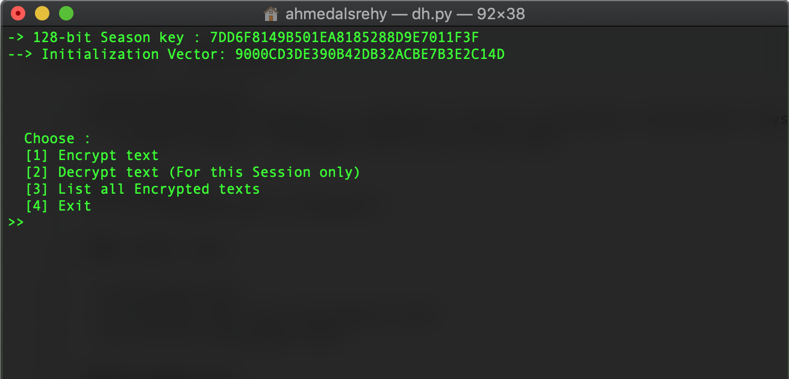

# diffie-hellman-ke
Diffie hellman key exchange is a method of securely exchanging cryptographic keys over a public channel.
-  `chilkat Library` (included) help me with this code.

### Screenshot

### Code Function :

- [1] Encrypt text
- [2] Decrypt text (For one Session only)
- [3] List all Encrypted texts

#### For more info :
1. Explain with exercism --> [Here](https://github.com/exercism/python/tree/master/exercises/diffie-hellman)
2. PDF file --> [Here](http://www.cse.unt.edu/~tarau/teaching/PP/NumberTheoretical/Diffie–Hellman%20key%20exchange.pdf)

 ## Who am i ?
 Ahmad A. Alsrehy
 
 Twitter : [@ADsecu](http://twitter.com/adsecu) 
